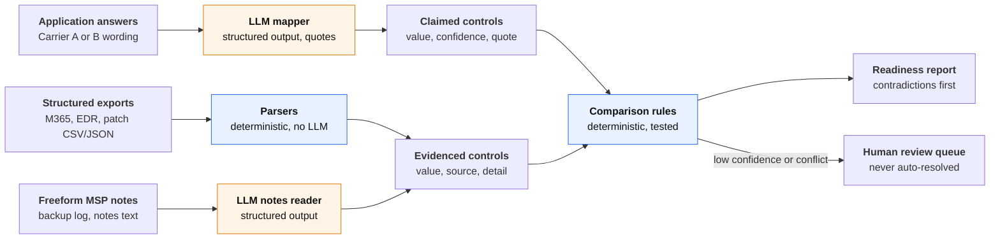

# coverage-readiness

A business can buy cyber insurance and still not be covered, because its application said something its environment doesn't back up. The person answering often isn't the person running IT, carrier questions vary, and the real state of MFA, EDR and backups lives with the MSP. This prototype checks the application against the MSP's evidence **before submission** and reports every answer that is contradicted, unsupported or unclear, so the agency and MSP can fix the environment or correct the answer.

It covers one way a business ends up uncovered (misrepresentation on the application), not all of them. All data is synthetic.

## Run it

Requires [uv](https://docs.astral.sh/uv/) and an Anthropic API key.

```bash
uv sync
cp .env.example .env          # then set ANTHROPIC_API_KEY
uv run coverage-readiness check fixtures/businesses/cedar_law --carrier carrier_a
```

Three synthetic businesses are included: `acme_dental` (clean), `birch_logistics` (EDR gap and untested backups) and `cedar_law` (claims MFA on the VPN; the VPN has none). Each can be checked against `carrier_a` or `carrier_b`. A run makes 3 LLM calls and costs about $0.05.

Output for `cedar_law` (excerpt):

```
As of 2026-10-08 · 1 contradicted · 0 needs review · 2 unverifiable · 7 supported
LLM: 3 calls (0 retries) · 7,194 tokens · $0.051 · 14.8s · claude-opus-5-5

Contradicted (1)
  MFA on remote access
    Claim     yes "Yes, MFA is required for email and VPN." (a2, conf 0.95)
    Evidence  SonicWall SSL-VPN on local firewall accounts with no MFA; Duo quote still
              awaiting approval. (msp_notes.txt, conf 0.95) "No MFA on the VPN yet."
    Why       The application says this is in place; the evidence shows it isn't.
```

The report lists contradictions first, then needs review, unverifiable and supported. Add `--output report.md` to save the markdown. Every LLM call is logged to `runs/<date>.jsonl` with model, prompt version, tokens, cost and latency.

## Architecture

The model only turns messy text into canonical fields. Structured exports skip the LLM entirely, and one deterministic, tested rule set makes every judgment.



Orange steps call the LLM; blue steps are plain code.

| Step | Approach | Why |
|---|---|---|
| Map carrier wording to canonical fields | LLM, structured output | Wording varies across carriers; rules would be brittle |
| Parse CSV/JSON exports | Deterministic | Already structured; an LLM adds cost and error |
| Read freeform MSP notes and logs | LLM, structured output | Unstructured text |
| Compare claim vs. evidence | Deterministic | High-stakes; must be explainable and testable |
| Decide what a human reviews | Deterministic thresholds | Auditable policy, tunable in one place |

**Ten canonical controls:** MFA on email, remote access and admin accounts; EDR on all endpoints; offline or immutable backups; a restore tested in the last 12 months; critical patch days; email filtering; security awareness training; and an incident response plan. The last two have no evidence source on purpose, so the system has to say "unverifiable" instead of guessing.

**Comparison precedence**, first match wins (see [`compare.py`](src/coverage_readiness/compare.py) and its [decision table](tests/test_compare.py)):

1. **Needs review:** the claim is missing, null, or has confidence below 0.8
2. **Needs review:** any LLM-read evidence has confidence below 0.8
3. **Unverifiable:** no evidence source exists, or no usable evidence was found
4. **Needs review:** evidence sources disagree with each other
5. **Supported or contradicted:** "all endpoints" means 100%, patch days are a ceiling, and an under-reported control is supported with a note

LLM calls use Claude Opus 5.5 with schema-constrained structured output. Every reply is validated with Pydantic, retried once with the validation error, and then fails loudly. Prompts are versioned files in [`llm/prompts/`](src/coverage_readiness/llm/prompts/).

## Evals

16 labeled scenarios: 4 clean, 5 single contradictions, 3 ambiguous answers, 2 where Carrier B's combined question hides a split, 1 under-reporting, and 1 prompt injection. The harness scores two places, so a mapping miss can be told apart from a rule miss: the claim value per field, and the final status per control.

| Metric (2 runs each) | v1 prompt | v2 prompt |
|---|---|---|
| Mapping accuracy | 98% / 98% | **100% / 100%** |
| Status accuracy | 98% / 97% | **99% / 99%** |
| Contradiction recall | 78% / 78% | **100% / 100%** |
| Contradiction precision | 100% / 100% | 100% / 100% |
| Review rate | 5% / 6% | 3% / 3% |
| Status stability across runs | 99% | 100% |
| Cost per application | $0.054 | $0.052 |

The v1 baseline sent two real gaps to needs review instead of contradicted, because it read plain or general "yes" answers too cautiously. v2 changed only the prompt. The ambiguous scenarios, which still go to review, guard against making it too eager. Full results: [v1](evals/results/2026-10-08-v1.md), [v2](evals/results/2026-10-08-v2.md).

```bash
uv run python evals/run_evals.py --runs 2                      # current prompt, about $1.70
uv run python evals/run_evals.py --application-prompt map_application_v1 --label v1-rerun
```

## Development

```bash
uv run pytest              # 115 unit tests, no network (fake LLM client)
uv run pytest -m live      # one real API call
uv run ruff check . && uv run ruff format --check .
```

CI runs ruff and pytest on every PR. The repo was built as 8 small PRs with Conventional Commits; the comparison tests were written before the implementation. [`CLAUDE.md`](CLAUDE.md) holds the conventions given to Claude Code, and [`docs/decisions.md`](docs/decisions.md) records the main design decisions.

```
src/coverage_readiness/
  schema.py           canonical controls, claims, evidence, findings
  parsers/            M365 MFA, EDR inventory, patches (deterministic)
  llm/                client, mapper, versioned prompts, run log
  compare.py          claim-vs-evidence rules
  pipeline.py         one business + one carrier -> findings
  report.py, cli.py   markdown report and `coverage-readiness check`
fixtures/             carrier question sets and 3 synthetic businesses
evals/                16 scenarios, harness, committed results
```

## Limitations

- **Synthetic data only.** Two carrier question sets written for this prototype, and three businesses.
- **A small eval set.** 16 scenarios with 9 expected contradictions, so "100% recall" means 9 of 9, run twice. It shows the approach works, not production accuracy.
- **Thresholds untuned on real data.** The 0.8 threshold rests on the model's self-reported confidence, which is not calibrated.
- **No real integrations.** Evidence comes from files, not M365, EDR or carrier APIs.
- **One known eval miss.** The evidence-notes prompt is still v1 and reads "USB rotation that Dana takes home" with low confidence, so that finding goes to review.
- **Quotes are not verified.** Source quotes come from the model and aren't yet checked against the input text.

## What I'd build next

1. **Verify every quote** appears in the source text, and send anything that doesn't to review. It's a cheap, deterministic guard against hallucinated support.
2. **Calibrate confidence** on real, labeled submissions, then tune the review threshold to a target review rate.
3. **A bigger eval set** built from anonymized real applications and more carrier question sets, with a v2 evidence-notes prompt.
4. **"Not applicable" answers and evidence freshness.** No VPN shouldn't count as a contradiction, and an export from six months ago should be flagged.
5. **A review workflow** that captures how a human resolved each item and feeds those decisions back into the eval set.
6. **Live evidence** from Microsoft Graph and EDR vendor APIs, plus an MSP-facing remediation list for each contradiction.
