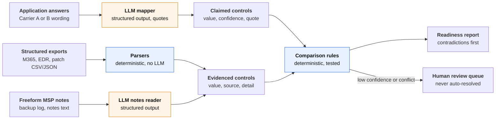

# coverage-readiness

A business can buy cyber insurance and still not be covered, because its application said something its environment doesn't back up. The person answering often isn't the person running IT, carrier questions vary, and the real state of MFA, EDR and backups lives with the MSP. This prototype checks the application against the MSP's evidence **before submission** and reports every answer that is contradicted, unsupported or unclear, so the agency and MSP can fix the environment or correct the answer.

It covers one way a business ends up uncovered (misrepresentation on the application), not all of them. All data is synthetic.

## Run it

Requires [uv](https://docs.astral.sh/uv/) and an Anthropic API key.

```bash
uv sync
cp .env.example .env          # then set ANTHROPIC_API_KEY
uv run coverage-readiness check fixtures/businesses/cedar_law --carrier carrier_a
```

Three synthetic businesses are included: `acme_dental` (clean), `birch_logistics` (EDR gap and untested backups) and `cedar_law` (claims MFA on the VPN; the VPN has none). Each can be checked against `carrier_a` or `carrier_b`. A run makes 3 LLM calls and costs about $0.025.

Output for `cedar_law` (excerpt):

```
As of 2026-10-08 · 1 contradicted · 0 needs review · 2 unverifiable · 7 supported
LLM: 3 calls (0 retries) · 7,071 tokens · $0.024 · 10.2s · claude-sonnet-5-5

Contradicted (1)
  MFA on remote access
    Claim     yes "Yes, MFA is required for email and VPN." (a2, conf 0.95)
    Evidence  SonicWall SSL-VPN uses local firewall accounts with no MFA; Duo quote still
              pending approval. (msp_notes.txt, conf 0.97) "No MFA on the VPN yet."
    Why       The application says this is in place; the evidence shows it isn't.
```

The report lists contradictions first, then needs review, unverifiable and supported. Add `--output report.md` to save the markdown, or `--model claude-sonnet-5-5` to use another model. Every LLM call is logged to `runs/<date>.jsonl` with model, prompt version, tokens, cost and latency.

## Architecture

The model only turns messy text into canonical fields. Structured exports skip the LLM entirely, and one deterministic, tested rule set makes every judgment.



Orange steps call the LLM; blue steps are plain code.

| Step | Approach | Why |
|---|---|---|
| Map carrier wording to canonical fields | LLM, structured output | Wording varies across carriers; rules would be brittle |
| Parse CSV/JSON exports | Deterministic | Already structured; an LLM adds cost and error |
| Read freeform MSP notes and logs | LLM, structured output | Unstructured text |
| Compare claim vs. evidence | Deterministic | High-stakes; must be explainable and testable |
| Decide what a human reviews | Deterministic thresholds | Auditable policy, tunable in one place |

**Ten canonical controls:** MFA on email, remote access and admin accounts; EDR on all endpoints; offline or immutable backups; a restore tested in the last 12 months; critical patch days; email filtering; security awareness training; and an incident response plan. The last two have no evidence source on purpose, so the system has to say "unverifiable" instead of guessing.

**Comparison precedence**, first match wins (see [`compare.py`](src/coverage_readiness/compare.py) and its [decision table](tests/test_compare.py)):

1. **Needs review:** the claim is missing, null, or has confidence below 0.8
2. **Needs review:** any LLM-read evidence has confidence below 0.8
3. **Unverifiable:** no evidence source exists, or no usable evidence was found
4. **Needs review:** evidence sources disagree with each other
5. **Supported or contradicted:** "all endpoints" means 100%, patch days are a ceiling, and an under-reported control is supported with a note

LLM calls use Claude Sonnet 5.5 by default, chosen by the [model comparison](#model-comparison) below, with schema-constrained structured output. Every reply is validated with Pydantic, retried once with the validation error, and then fails loudly. Prompts are versioned files in [`llm/prompts/`](src/coverage_readiness/llm/prompts/).

## Seed data

Everything below is synthetic and written for this prototype. The source files are in [`fixtures/`](fixtures/).

### Businesses

| Business | Who filled in the application | What the evidence shows | Expected findings |
|---|---|---|---|
| [`acme_dental`](fixtures/businesses/acme_dental/story.md) | Office manager, with the MSP on the phone | 12-person dental practice. Every answer matches the environment: MFA enforced for all staff, VPN through Entra with MFA, SentinelOne on 14 of 14 devices, immutable Wasabi backups, restore tested June 2026. | 8 supported, 2 unverifiable |
| [`birch_logistics`](fixtures/businesses/birch_logistics/story.md) | Owner | 30-person freight broker. CrowdStrike active on only **47 of 50** devices (two laptops never got the agent, one sensor offline). **No restore test** since moving to Datto in 2024. | EDR and restore test **contradicted** |
| [`cedar_law`](fixtures/businesses/cedar_law/story.md) | Firm administrator | 18-person law firm. Reused last year's answer "MFA is required for email and VPN." The SSL-VPN uses local firewall accounts with **no MFA**; a Duo quote is still awaiting approval. | MFA on remote access **contradicted** |

Training and the incident response plan are unverifiable for every business: none of the MSP evidence can show them, so the tool says so instead of guessing.

Each business also has MSP evidence: an M365 MFA report (CSV), an EDR device inventory (JSON), a patch export (CSV), a backup log and free-text MSP notes.

The "Intended controls" column below is for readers. The tool never sees it: mapping each question to controls is the LLM mapper's job, and the evals check that it gets them right.

### Carrier A questions

One question per control.

| ID | Question | Intended controls |
|---|---|---|
| `a1` | Is multi-factor authentication required for every user to access company email, including webmail and mobile apps? | MFA on email |
| `a2` | Is multi-factor authentication required for all remote access to your network, such as VPN or Remote Desktop (RDP)? | MFA on remote access |
| `a3` | Is multi-factor authentication enforced on all administrator and other privileged accounts? | MFA on admin accounts |
| `a4` | Is an endpoint detection and response (EDR) product installed on all endpoints? Please name the product. | EDR on all endpoints |
| `a5` | Do you keep at least one copy of your backups offline, air-gapped or immutable? | Offline/immutable backups |
| `a6` | Have you successfully restored data from backup as a test within the last 12 months? | Restore tested (12 mo) |
| `a7` | Within how many days of release are critical security patches applied? | Critical patch days |
| `a8` | Do you use an email filtering or secure email gateway product? | Email filtering |
| `a9` | Do all employees complete security awareness training at least once a year? | Awareness training |
| `a10` | Do you have a written incident response plan? | Incident response plan |

### Submitted answers: Carrier A

| ID | Acme Dental | Birch Logistics | Cedar Law |
|---|---|---|---|
| `a1` | Yes. Everyone uses the Microsoft Authenticator app for Outlook, including on their phones. | Yes | Yes, MFA is required for email and VPN. |
| `a2` | Yes. The VPN requires MFA through Microsoft, and we don't allow RDP from outside. | Yes, Duo on the VPN. | Yes, MFA is required for email and VPN. |
| `a3` | Yes, both admin accounts require MFA. | Yes | Yes, admins use MFA. |
| `a4` | Yes, SentinelOne is on every computer and both servers. | Yes - CrowdStrike on all endpoints. | Yes. Microsoft Defender for Endpoint on all devices. |
| `a5` | Yes. We keep an immutable copy in Wasabi cloud storage in addition to the local NAS. | Yes, we rotate USB drives offsite weekly. | Yes, Acronis immutable cloud backups. |
| `a6` | Yes. Our MSP did a full test restore of the server in June 2026. | Yes, we test our backups regularly. | Yes, we did a full test restore in March 2026. |
| `a7` | 14 days | 30 | Within 14 days. |
| `a8` | Yes, Microsoft Defender for Office 365. | Yes, Mimecast. | Yes, Proofpoint. |
| `a9` | Yes, everyone does annual training. | Yes | Yes, annual training through KnowBe4. |
| `a10` | Yes, we have a written plan. | No, we're working on one. | Yes |

### Carrier B questions

Different wording, and combined questions: `b1` covers all three MFA controls and `b3` covers both backup controls.

| ID | Question | Intended controls |
|---|---|---|
| `b1` | Describe where multi-factor authentication is enforced in your organization, including email, remote access (VPN/RDP) and administrative accounts. | MFA on email, MFA on remote access, MFA on admin accounts |
| `b2` | What endpoint protection or EDR tool do you use, and what share of your laptops, desktops and servers does it cover? | EDR on all endpoints |
| `b3` | Describe your backup approach, including whether any copy is kept offline or immutable and when you last tested a full restore. | Offline/immutable backups, Restore tested (12 mo) |
| `b4` | What is your target timeframe for deploying critical patches? | Critical patch days |
| `b5` | Are inbound emails scanned for malicious links and attachments before they reach users? | Email filtering |
| `b6` | Is phishing or security awareness training provided to staff? If so, how often? | Awareness training |
| `b7` | Is there a documented plan for responding to a cyber incident? | Incident response plan |

### Submitted answers: Carrier B

| ID | Acme Dental | Birch Logistics | Cedar Law |
|---|---|---|---|
| `b1` | MFA is required for email for all staff, for the VPN (it signs in through Microsoft), and for both admin accounts. RDP isn't open to the internet. | MFA everywhere - email, Duo on the VPN, and the admin accounts. | MFA is required for email and VPN, and all admin accounts use it. |
| `b2` | SentinelOne, on 100% of our computers and servers. | CrowdStrike Falcon, covers all of them. | Microsoft Defender for Endpoint on every workstation and server. |
| `b3` | Nightly backups to a local NAS plus an immutable cloud copy in Wasabi. The last full restore test was in June 2026 and it worked. | Datto backs up nightly to the cloud and we rotate USB drives offsite every week. Backups are tested regularly. | Acronis backs up our servers nightly to immutable cloud storage. We tested a full restore in March 2026. |
| `b4` | Within 14 days. | 30 days | 14 days. |
| `b5` | Yes, Defender for Office 365 scans links and attachments. | Yes, Mimecast. | Yes, through Proofpoint. |
| `b6` | Yes, once a year for all staff. | Yes, yearly. | Annually, using KnowBe4. |
| `b7` | Yes, we have a written incident response plan. | Not yet, it's in progress. | Yes, we have a documented incident response plan. |

## Evals

16 labeled scenarios: 4 clean, 5 single contradictions, 3 ambiguous answers, 2 where Carrier B's combined question hides a split, 1 under-reporting, and 1 prompt injection. The harness scores two places, so a mapping miss can be told apart from a rule miss: the claim value per field, and the final status per control.

| Metric (2 runs each, Opus 5.5) | v1 prompt | v2 prompt |
|---|---|---|
| Mapping accuracy | 98% / 98% | **100% / 100%** |
| Status accuracy | 98% / 97% | **99% / 99%** |
| Contradiction recall | 78% / 78% | **100% / 100%** |
| Contradiction precision | 100% / 100% | 100% / 100% |
| Review rate | 5% / 6% | 3% / 3% |
| Status stability across runs | 99% | 100% |
| Cost per application | $0.054 | $0.052 |

The v1 baseline sent two real gaps to needs review instead of contradicted, because it read plain or general "yes" answers too cautiously. v2 changed only the prompt. The ambiguous scenarios, which still go to review, guard against making it too eager. Full results: [v1](evals/results/2026-10-08-v1.md), [v2](evals/results/2026-10-08-v2.md).

```bash
uv run python evals/run_evals.py --runs 2                      # current prompt and model, about $0.85
uv run python evals/run_evals.py --application-prompt map_application_v1 --label v1-rerun
uv run python evals/run_evals.py --model claude-haiku-5-5          # compare another model
```

### Model comparison

The same 16 scenarios and v2 prompts on three models, 2 runs each:

| Metric (2 runs) | Opus 5.5 | Sonnet 5.5 (default) | Haiku 5.5 |
|---|---|---|---|
| Contradiction recall | 100% / 100% | 100% / 100% | 100% / 100% |
| Contradiction precision | 100% / 100% | 100% / 100% | 100% / 100% |
| Status accuracy | 99.4% / 99.4% | **100% / 100%** | 98.8% / 98.8% |
| Review rate | 3.1% / 3.1% | 2.5% / 2.5% | 2.5% / 2.5% |
| Status stability across runs | 100% | 100% | 98.8% |
| Cost per application | $0.052 | **$0.026** | **$0.0016** |
| Latency per application (p50) | 16.1s / 16.4s | **9.3s / 9.2s** | 11.6s / 12.3s |

All three catch every contradiction on this set. **Sonnet 5.5 made no mistakes**, at half Opus's cost and about 45% faster, so it's the default. Opus missed only the known USB-rotation note. **Haiku 5.5 is about 30× cheaper than Opus**, but it read the vague answer "We back up to the cloud" as a confident "no" in both runs instead of sending it to review. That's harmless here, because the evidence showed backups in place. Full results: [Sonnet](evals/results/2026-10-08-v2-sonnet-5-5.md), [Haiku](evals/results/2026-10-08-v2-haiku-5-5.md).

**The evals picked the model.** Sonnet 5.5 beat Opus 5.5 on accuracy at half the cost. Haiku 5.5 was 30× cheaper but overconfident on vague answers, which is exactly what this domain can't afford. With Sonnet as the default, a check takes about 10 seconds instead of 15 and costs about 2.5¢.

## Development

```bash
uv run pytest              # 118 unit tests, no network (fake LLM client)
uv run pytest -m live      # one real API call
uv run ruff check . && uv run ruff format --check .
```

CI runs ruff and pytest on every PR. The repo was built as 8 small PRs with Conventional Commits; the comparison tests were written before the implementation. [`CLAUDE.md`](CLAUDE.md) holds the conventions given to Claude Code, and [`docs/decisions.md`](docs/decisions.md) records the main design decisions.

```
src/coverage_readiness/
  schema.py           canonical controls, claims, evidence, findings
  parsers/            M365 MFA, EDR inventory, patches (deterministic)
  llm/                client, mapper, versioned prompts, run log
  compare.py          claim-vs-evidence rules
  pipeline.py         one business + one carrier -> findings
  report.py, cli.py   markdown report and `coverage-readiness check`
fixtures/             carrier question sets and 3 synthetic businesses
evals/                16 scenarios, harness, committed results
```

## Limitations

- **Synthetic data only.** Two carrier question sets written for this prototype, and three businesses.
- **A small eval set.** 16 scenarios with 9 expected contradictions, so "100% recall" means 9 of 9, run twice. It shows the approach works, not production accuracy.
- **Thresholds untuned on real data.** The 0.8 threshold rests on the model's self-reported confidence, which is not calibrated.
- **No real integrations.** Evidence comes from files, not M365, EDR or carrier APIs.
- **One known eval miss.** The evidence-notes prompt is still v1 and reads "USB rotation that Dana takes home" with low confidence, so that finding goes to review.
- **Quotes are not verified.** Source quotes come from the model and aren't yet checked against the input text.
