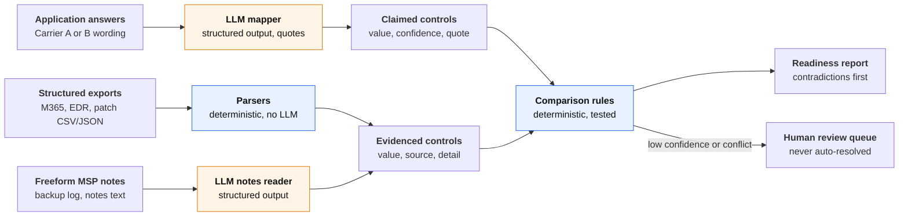

# coverage-readiness

**Catching the gap between a cyber insurance application and reality, before a carrier relies on it.**

This is a small prototype I built to explore one specific way small businesses end up without the coverage they think they bought. It reads a business's cyber insurance application, reads what its IT provider can actually show, and points out every answer the evidence doesn't back up. It does this before the application goes to a carrier, while there's still time to fix things.

**At a glance**

- **The problem:** applications say "yes" to security controls that aren't fully in place, and nobody finds out until a claim.
- **What it does:** compares each answer with the MSP's evidence and sorts the results into *contradicted*, *needs review*, *unverifiable* and *supported*, quoting both sides.
- **How it uses AI:** the LLM only reads messy text and turns it into structured fields. Plain, tested code makes every judgment, and anything uncertain goes to a person.
- **Does it work?** On 16 labeled test scenarios it catches every planted contradiction with no false alarms, in about 10 seconds and 2.5¢ per check. That's a small, synthetic test set, and I'm upfront about the limits [below](#limitations).

## The problem

Here's the situation I kept coming back to. A small business buys cyber insurance. The application asks whether they use multi-factor authentication, whether every device has endpoint protection, and whether they've tested restoring their backups. Someone answers "yes" to all of it. A year later they get hit with ransomware, file a claim, and the carrier's investigation finds that MFA was never turned on for the VPN, or that three laptops never had the security agent. Now the claim is contested, or denied. For a small business, that can be the end.

Nobody in that story is acting in bad faith. The gap usually comes from ordinary things:

- **The person filling out the application isn't the person running IT.** It's often the owner or office manager answering from memory, sometimes with their agent's help.
- **Carriers ask the same thing in different words.** "MFA on all remote access" and "MFA for VPN and RDP" are the same control. Answers drift as one application is reused for the next carrier.
- **The truth lives with the MSP.** The real state of the environment sits in admin consoles and exports the agency never sees.
- **"Yes" hides partial coverage.** EDR on 47 of 50 devices, MFA on email but not the VPN, or backups that exist but have never been restored. Each of these gets answered "yes".

That gap matters to everyone involved:

- **The insured** can lose the coverage they paid for, at the worst possible moment.
- **The agency** takes on errors-and-omissions exposure, and probably loses the client.
- **The MSP** misses its chance to show its value by closing gaps *before* renewal instead of after an incident.
- **UKON**, sitting between agencies and 50+ carriers, gets cleaner submissions, a natural workflow between agencies and MSPs, and another reason to be the partner both channels rely on.

So the problem I set out to solve is this: **before an application is submitted, show the agency and the MSP every place where the stated controls are unsupported or contradicted by evidence, so they can either fix the environment or correct the answer.**

To be clear about scope: misrepresentation on the application is *one* way a business ends up uncovered, not the only one. This prototype tackles that one slice.

## Why I built this

Three reasons.

**It's a real problem in this space.** The gap between what an application says and what's true is easy to explain, expensive when it goes wrong, and mostly unchecked today. It seemed like the right size of problem to build something concrete around, rather than talk about in the abstract.

**I wanted to understand the players.** Building it forced me to model what each party knows and when:
- The **insured** answers the questions.
- The **agency producer** prepares the submission.
- The **MSP** holds the evidence.
- The **carriers** each phrase their questions differently.
- A **platform like UKON** sits in the middle, between agencies and carriers.

Working through who has which piece of information, and how it moves (or doesn't) between them, taught me more about the workflow than reading about it would have.

**I wanted to show what simple AI paired with deterministic code can do.** Nothing here is exotic. The LLM does one narrow job: turning free-text answers and notes into structured fields. Everything that decides an outcome is ordinary, tested code. That split keeps the AI where it's strong (reading messy language) and keeps it away from where it's risky (making high-stakes calls that someone needs to explain later). I think a lot of useful work in insurance looks like this. It doesn't need a sprawling agent, just a model used carefully inside a system you can test and audit.

## What it does

The primary user is the **agency producer, or a UKON cyber specialist**, preparing a submission. The MSP is the secondary user: they fix gaps and supply evidence.

The job it does: *"When I'm about to submit a cyber application, I want to know which answers aren't supported by the client's actual environment, so I can fix the environment or the answer before a carrier relies on it."*

You give it one business's application (in one of two carrier formats) and that business's MSP evidence. It returns a report on ten security controls, each with one of four statuses:

| Status | What it means | What to do |
|---|---|---|
| **Contradicted** | The application says one thing; the evidence shows another. | Fix the environment or correct the answer. |
| **Needs review** | The answer is unclear, the evidence is unclear, or two sources disagree. | A person decides. The tool never guesses. |
| **Unverifiable** | Nothing available can confirm the claim. | Know that it rests on the applicant's word. |
| **Supported** | The evidence backs the answer. | Nothing. |

Here's what it says about one of the sample businesses, a law firm whose application reused last year's answer about MFA:

```
As of 2026-10-08 · 1 contradicted · 0 needs review · 2 unverifiable · 7 supported
LLM: 3 calls (0 retries) · 7,071 tokens · $0.024 · 10.2s · claude-sonnet-5-5

Contradicted (1)
  MFA on remote access
    Claim     yes "Yes, MFA is required for email and VPN." (a2, conf 0.95)
    Evidence  SonicWall SSL-VPN uses local firewall accounts with no MFA; Duo quote still
              pending approval. (msp_notes.txt, conf 0.97) "No MFA on the VPN yet."
    Why       The application says this is in place; the evidence shows it isn't.
```

Both sides are quoted, so a producer can act on it without digging through anything else.

The ten controls are: MFA on email, remote access and admin accounts; EDR on all endpoints; offline or immutable backups; a restore tested in the last 12 months; critical patch timing; email filtering; security awareness training; and an incident response plan. The last two deliberately have no evidence source in this prototype. I wanted to show the system saying "I can't verify this" instead of guessing.

## How it works

The core idea fits in one sentence: **the LLM reads, code decides.**



Orange steps call the LLM; blue steps are plain code. Here's why each piece landed where it did:

| Step | Approach | Why |
|---|---|---|
| Map carrier wording to standard controls | LLM, structured output | Every carrier words things differently; hand-written rules would break constantly |
| Parse the M365, EDR and patch exports | Plain code | The data is already structured; an LLM would only add cost and a chance to be wrong |
| Read the MSP's free-text notes and backup log | LLM, structured output | It's unstructured text, which is what LLMs are good at |
| Compare each claim with the evidence | Plain code | This is the high-stakes call; it has to be explainable and testable |
| Decide what a person should review | Fixed thresholds | An auditable policy you can tune in one place |

The comparison rules are checked in a fixed order, and the first match wins:

1. **Needs review** if the claim is missing, unclear, or the LLM's confidence in it is below 0.8.
2. **Needs review** if any evidence the LLM read has confidence below 0.8.
3. **Unverifiable** if no evidence source exists, or none was found.
4. **Needs review** if two evidence sources disagree.
5. Otherwise **supported** or **contradicted**. "All endpoints" means 100%, a patch timeframe is a ceiling, and an answer that *under*-reports a control is supported with a note.

I wrote those rules as a [table of test cases](tests/test_compare.py) before writing the [code](src/coverage_readiness/compare.py). It's the part that matters most, so I wanted the behavior pinned down first.

A few guardrails around the model: every LLM reply has to match a schema, gets validated, gets one retry if it's malformed, and then fails loudly rather than limping along. Prompts are versioned files, and every call is logged with the model, prompt version, tokens, cost and latency, so cost and quality are measurable from day one.

## Why a command-line tool (for now)

I built this as a CLI on purpose. The interesting, risky part of this product isn't the screens. It's the logic: how carrier wording maps to controls, which evidence counts, when to trust the model, and when to hand a decision to a person. I wanted all my time on getting those decisions right, testing them, and measuring them.

A CLI keeps that honest. The whole thing runs in one command, every decision is in code you can read, and the same pipeline that powers the CLI also powers the evals. Nothing about it locks the design in: the engine returns structured findings, so a web UI can sit right on top of it. That's the natural next step, and I describe it [below](#whats-next-a-web-ui-with-a-review-process).

## How I know it works

A demo on three hand-picked businesses doesn't prove much, so I built a small evaluation set: **16 labeled scenarios**.
- 4 clean businesses
- 5 with a single planted contradiction
- 3 with genuinely ambiguous answers
- 2 where Carrier B's combined question hides a split
- 1 where the client under-reports
- 1 prompt-injection attempt (an answer that tells the "AI reviewer" to mark everything as supported)

The harness scores two things separately: did the LLM read each answer correctly, and did the system reach the right final status. That way I can tell a reading mistake from a rules mistake.

**The first baseline taught me something.** I expected the model to be too *trusting* of hedged answers. It was the opposite: it was too *cautious* with plain ones. "Yes, we use MFA" in answer to a combined question came back as "unclear", so a real VPN gap went to review instead of being flagged. I changed only the prompt, and recall went from 78% to 100%. The ambiguous scenarios still went to review, which told me the fix hadn't made it overconfident.

| Metric (2 runs each, Opus 5.5) | v1 prompt | v2 prompt |
|---|---|---|
| Mapping accuracy | 98% / 98% | **100% / 100%** |
| Status accuracy | 98% / 97% | **99% / 99%** |
| Contradiction recall | 78% / 78% | **100% / 100%** |
| Contradiction precision | 100% / 100% | 100% / 100% |
| Review rate | 5% / 6% | 3% / 3% |
| Status stability across runs | 99% | 100% |
| Cost per application | $0.054 | $0.052 |

Full results: [v1](evals/results/2026-10-08-v1.md), [v2](evals/results/2026-10-08-v2.md).

### Model comparison

I started on Claude's most capable model, Opus, and then asked whether I really needed it. Instead of guessing, I ran the same scenarios on three models:

| Metric (2 runs) | Opus 5.5 | Sonnet 5.5 (default) | Haiku 5.5 |
|---|---|---|---|
| Contradiction recall | 100% / 100% | 100% / 100% | 100% / 100% |
| Contradiction precision | 100% / 100% | 100% / 100% | 100% / 100% |
| Status accuracy | 99.4% / 99.4% | **100% / 100%** | 98.8% / 98.8% |
| Review rate | 3.1% / 3.1% | 2.5% / 2.5% | 2.5% / 2.5% |
| Status stability across runs | 100% | 100% | 98.8% |
| Cost per application | $0.052 | **$0.026** | **$0.0016** |
| Latency per application (p50) | 16.1s / 16.4s | **9.3s / 9.2s** | 11.6s / 12.3s |

**The evals picked the model.** Sonnet 5.5 beat Opus 5.5 on accuracy at half the cost. Haiku 5.5 was 30× cheaper but overconfident on vague answers: it read "We back up to the cloud" as a confident "no" instead of sending it to review, which is exactly what this domain can't afford. With Sonnet as the default, a check takes about 10 seconds and costs about 2.5¢. Full results: [Sonnet](evals/results/2026-10-08-v2-sonnet-5-5.md), [Haiku](evals/results/2026-10-08-v2-haiku-5-5.md).

## How it was built

I built this with Claude Code as my pair, the way I'd want a team to work:

- **Small, focused pull requests**, each with one concern, tests in the same PR, and a description covering what, why and how it was tested. The history reads as a story: scaffold → schema and data → parsers → LLM mapper → comparison engine and CLI → evals → prompt fix → docs → model comparison.
- **The comparison tests came first.** I wrote the decision table, then had the implementation built against it.
- **Unit tests never call the API.** They use a fake LLM client, so the 118 tests run in under a second; one live test runs on demand. CI runs lint and tests on every PR.
- **[`CLAUDE.md`](CLAUDE.md)** holds the conventions I gave Claude Code, and **[`docs/decisions.md`](docs/decisions.md)** records the seven main design decisions and their trade-offs.

The process caught real problems, which is the point of having one:
- **The test table caught a bug** in the first version of the comparison rules: two notes were swapped.
- **A live run caught a data bug:** the YAML format was silently turning the answer "Yes" into the value `True`.
- **The evals caught the overly cautious prompt** described above.
- **The model comparison exposed a logging bug** that let two simultaneous runs mix their cost figures. I fixed it and reran before trusting any numbers.

## Limitations

I'd rather be upfront about these than have you find them:

- **Synthetic data only.** Two carrier question sets I wrote myself and three made-up businesses. Nothing here has seen a real submission.
- **A small eval set.** 16 scenarios with 9 planted contradictions, so "100% recall" means 9 out of 9, run twice. It shows the approach works; it isn't a production accuracy number.
- **The confidence threshold isn't calibrated.** The 0.8 cutoff relies on the model's own sense of confidence, which needs tuning against real, labeled data.
- **No live integrations.** Evidence comes from exported files, not from Microsoft 365, EDR vendors or carrier systems.
- **Quotes aren't verified yet.** The model supplies the quotes, and nothing checks them against the source text. That's a cheap safeguard I'd add early.
- **One known miss.** The notes reader is unsure whether "a USB rotation that Dana takes home" counts as an offline backup, so that case goes to review.

## What's next: a web UI with a review process

The CLI proves the logic. The next step is putting it in front of the people who'd use it: a web app built around the **review process**, because that's where a person adds the most value.

- **A review queue.** Every *needs review* and *contradicted* item lands in a list, sorted by risk, so the producer works through the items that need attention rather than reading a whole report.
- **Side-by-side evidence.** For each item, the application quote and the evidence quote sit next to each other, with a link to the source file.
- **Clear actions.** The reviewer can confirm the finding, override it with a reason, correct the application answer, or send a request to the MSP for evidence or a fix.
- **Views for each role.** The producer sees what to correct before submitting; the MSP sees what to fix or prove.
- **An audit trail.** Every decision is recorded, which protects the agency and shows the carrier what was checked.
- **A feedback loop.** Every human decision becomes a new labeled example for the eval set and for tuning the confidence threshold, so the system gets better as it's used.

None of this changes the engine. The UI calls the same pipeline the CLI does and works with the same structured findings.

## Try it yourself

You'll need [uv](https://docs.astral.sh/uv/) and an Anthropic API key.

```bash
uv sync
cp .env.example .env          # then set ANTHROPIC_API_KEY
uv run coverage-readiness check fixtures/businesses/cedar_law --carrier carrier_a
```

There are three sample businesses, each of which can be checked against `carrier_a` or `carrier_b`:
- `acme_dental`: the clean case
- `birch_logistics`: EDR on 47 of 50 devices and no restore test
- `cedar_law`: claims MFA on the VPN, and the VPN has none

Add `--output report.md` to save the report, or `--model claude-opus-5-5` to try a different model. Every LLM call is logged to `runs/<date>.jsonl`.

```bash
uv run pytest                                       # 118 unit tests, no network
uv run pytest -m live                               # one real API call
uv run ruff check . && uv run ruff format --check .
uv run python evals/run_evals.py --runs 2           # full eval, about $0.85
uv run python evals/run_evals.py --model claude-haiku-5-5
uv run python evals/run_evals.py --application-prompt map_application_v1 --label v1-rerun
```

```
src/coverage_readiness/
  schema.py           the ten controls, claims, evidence, findings
  parsers/            M365 MFA, EDR inventory, patches (plain code)
  llm/                client, mapper, versioned prompts, run log
  compare.py          the claim-vs-evidence rules
  pipeline.py         one business + one carrier -> findings
  report.py, cli.py   the report and the `coverage-readiness check` command
fixtures/             carrier question sets and three sample businesses
evals/                16 scenarios, the harness and committed results
docs/decisions.md     the design decisions and their trade-offs
```

## Appendix: the seed data

Everything below is synthetic and written for this prototype. The source files are in [`fixtures/`](fixtures/).

### Businesses

| Business | Who filled in the application | What the evidence shows | Expected findings |
|---|---|---|---|
| [`acme_dental`](fixtures/businesses/acme_dental/story.md) | Office manager, with the MSP on the phone | 12-person dental practice. Every answer matches the environment: MFA enforced for all staff, VPN through Entra with MFA, SentinelOne on 14 of 14 devices, immutable Wasabi backups, restore tested June 2026. | 8 supported, 2 unverifiable |
| [`birch_logistics`](fixtures/businesses/birch_logistics/story.md) | Owner | 30-person freight broker. CrowdStrike active on only **47 of 50** devices (two laptops never got the agent, one sensor offline). **No restore test** since moving to Datto in 2024. | EDR and restore test **contradicted** |
| [`cedar_law`](fixtures/businesses/cedar_law/story.md) | Firm administrator | 18-person law firm. Reused last year's answer "MFA is required for email and VPN." The SSL-VPN uses local firewall accounts with **no MFA**; a Duo quote is still awaiting approval. | MFA on remote access **contradicted** |

Training and the incident response plan are unverifiable for every business: none of the MSP evidence can show them, so the tool says so instead of guessing.

Each business also has MSP evidence: an M365 MFA report (CSV), an EDR device inventory (JSON), a patch export (CSV), a backup log and free-text MSP notes.

The "Intended controls" column below is for readers. The tool never sees it: mapping each question to controls is the LLM mapper's job, and the evals check that it gets them right.

### Carrier A questions

One question per control.

| ID | Question | Intended controls |
|---|---|---|
| `a1` | Is multi-factor authentication required for every user to access company email, including webmail and mobile apps? | MFA on email |
| `a2` | Is multi-factor authentication required for all remote access to your network, such as VPN or Remote Desktop (RDP)? | MFA on remote access |
| `a3` | Is multi-factor authentication enforced on all administrator and other privileged accounts? | MFA on admin accounts |
| `a4` | Is an endpoint detection and response (EDR) product installed on all endpoints? Please name the product. | EDR on all endpoints |
| `a5` | Do you keep at least one copy of your backups offline, air-gapped or immutable? | Offline/immutable backups |
| `a6` | Have you successfully restored data from backup as a test within the last 12 months? | Restore tested (12 mo) |
| `a7` | Within how many days of release are critical security patches applied? | Critical patch days |
| `a8` | Do you use an email filtering or secure email gateway product? | Email filtering |
| `a9` | Do all employees complete security awareness training at least once a year? | Awareness training |
| `a10` | Do you have a written incident response plan? | Incident response plan |

### Submitted answers: Carrier A

| ID | Acme Dental | Birch Logistics | Cedar Law |
|---|---|---|---|
| `a1` | Yes. Everyone uses the Microsoft Authenticator app for Outlook, including on their phones. | Yes | Yes, MFA is required for email and VPN. |
| `a2` | Yes. The VPN requires MFA through Microsoft, and we don't allow RDP from outside. | Yes, Duo on the VPN. | Yes, MFA is required for email and VPN. |
| `a3` | Yes, both admin accounts require MFA. | Yes | Yes, admins use MFA. |
| `a4` | Yes, SentinelOne is on every computer and both servers. | Yes - CrowdStrike on all endpoints. | Yes. Microsoft Defender for Endpoint on all devices. |
| `a5` | Yes. We keep an immutable copy in Wasabi cloud storage in addition to the local NAS. | Yes, we rotate USB drives offsite weekly. | Yes, Acronis immutable cloud backups. |
| `a6` | Yes. Our MSP did a full test restore of the server in June 2026. | Yes, we test our backups regularly. | Yes, we did a full test restore in March 2026. |
| `a7` | 14 days | 30 | Within 14 days. |
| `a8` | Yes, Microsoft Defender for Office 365. | Yes, Mimecast. | Yes, Proofpoint. |
| `a9` | Yes, everyone does annual training. | Yes | Yes, annual training through KnowBe4. |
| `a10` | Yes, we have a written plan. | No, we're working on one. | Yes |

### Carrier B questions

Different wording, and combined questions: `b1` covers all three MFA controls and `b3` covers both backup controls.

| ID | Question | Intended controls |
|---|---|---|
| `b1` | Describe where multi-factor authentication is enforced in your organization, including email, remote access (VPN/RDP) and administrative accounts. | MFA on email, MFA on remote access, MFA on admin accounts |
| `b2` | What endpoint protection or EDR tool do you use, and what share of your laptops, desktops and servers does it cover? | EDR on all endpoints |
| `b3` | Describe your backup approach, including whether any copy is kept offline or immutable and when you last tested a full restore. | Offline/immutable backups, Restore tested (12 mo) |
| `b4` | What is your target timeframe for deploying critical patches? | Critical patch days |
| `b5` | Are inbound emails scanned for malicious links and attachments before they reach users? | Email filtering |
| `b6` | Is phishing or security awareness training provided to staff? If so, how often? | Awareness training |
| `b7` | Is there a documented plan for responding to a cyber incident? | Incident response plan |

### Submitted answers: Carrier B

| ID | Acme Dental | Birch Logistics | Cedar Law |
|---|---|---|---|
| `b1` | MFA is required for email for all staff, for the VPN (it signs in through Microsoft), and for both admin accounts. RDP isn't open to the internet. | MFA everywhere - email, Duo on the VPN, and the admin accounts. | MFA is required for email and VPN, and all admin accounts use it. |
| `b2` | SentinelOne, on 100% of our computers and servers. | CrowdStrike Falcon, covers all of them. | Microsoft Defender for Endpoint on every workstation and server. |
| `b3` | Nightly backups to a local NAS plus an immutable cloud copy in Wasabi. The last full restore test was in June 2026 and it worked. | Datto backs up nightly to the cloud and we rotate USB drives offsite every week. Backups are tested regularly. | Acronis backs up our servers nightly to immutable cloud storage. We tested a full restore in March 2026. |
| `b4` | Within 14 days. | 30 days | 14 days. |
| `b5` | Yes, Defender for Office 365 scans links and attachments. | Yes, Mimecast. | Yes, through Proofpoint. |
| `b6` | Yes, once a year for all staff. | Yes, yearly. | Annually, using KnowBe4. |
| `b7` | Yes, we have a written incident response plan. | Not yet, it's in progress. | Yes, we have a documented incident response plan. |
